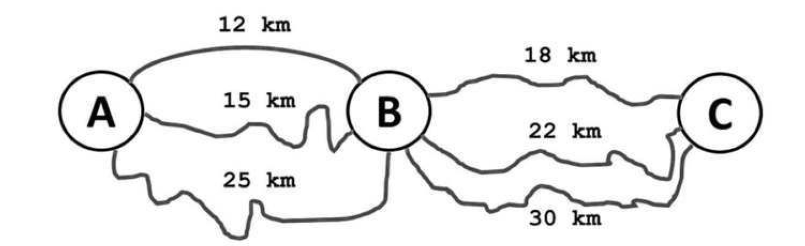
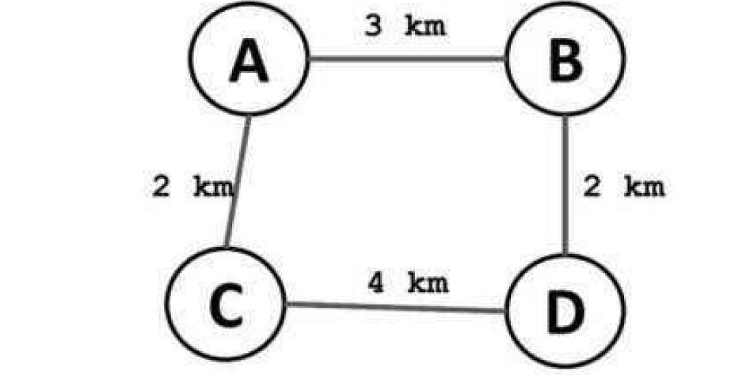

# googling
Data Structures and Algorithms

Tree:
- [x] Tree representation in java
- [x]  BST find node (Recursive & Iterative)
- [x]  Min-Heap & Max-Heap ([Heap](https://www.interviewcake.com/concept/java/heap) & [Heap](https://www.hackerearth.com/practice/data-structures/trees/heapspriority-queues/tutorial/)) 
- [x]  BFS & DFS
- [x]  Pre-order , In-order & Post-order Traversals (only recursive way till now)
- [x]  Height of a tree
- [x]  print nodes of BST in sorted order , use Inorder traversal

### Dynamic Programming

#### `Optimal substructure`    
It is when a problem is composed of subproblems of `same type` . Same type is the key here

Let's consider an example:

1. In this example  
 
 we have to find the shortest path between A -> C . Now, this can be broken down
into two subproblems ,i.e. shortest path from A -> B + shortest path from B -> C  
So, the problem can be said to be composed of subproblems of `same tyoe` i.e. both were of same nature of finiding the `shortest`

2. Now consider the below example:  
  
  In this we have to find the longest distance between A -> D. The longest distance comes out to be 6KM via C,
  however we have to note that this is not a combination of `longest distance between A -> C` and `longest distance between
  C -> D` . Because in that case A -> C would had the value `3+2+4=9KM` and C -> D would had `2+3+2=7KM`,
  thus this problem `cannot` be said to be composed of subprolems of `Same Type` . They are not of same type i.e. find longest path of every subproblem, thus this example `doesn't exhibit the property of Optimal subtructure`
  

#### `Overlapping Subproblems`  
 This happens when the subproblems are calculating the problems which have been already calculated earlier by another subproblem.  
Consider the example of `Fibonacci`  (without any optimisation or memoization)when we calculate Fib(5) , then fib(3) gets calculated more than 1 time, so as fib(2) etc.
Thus this problem of fibonacci can be said to have overlapping subproblems, because subproblems are overlapping or in other words going over the same problem which has been calculated earlier. 

